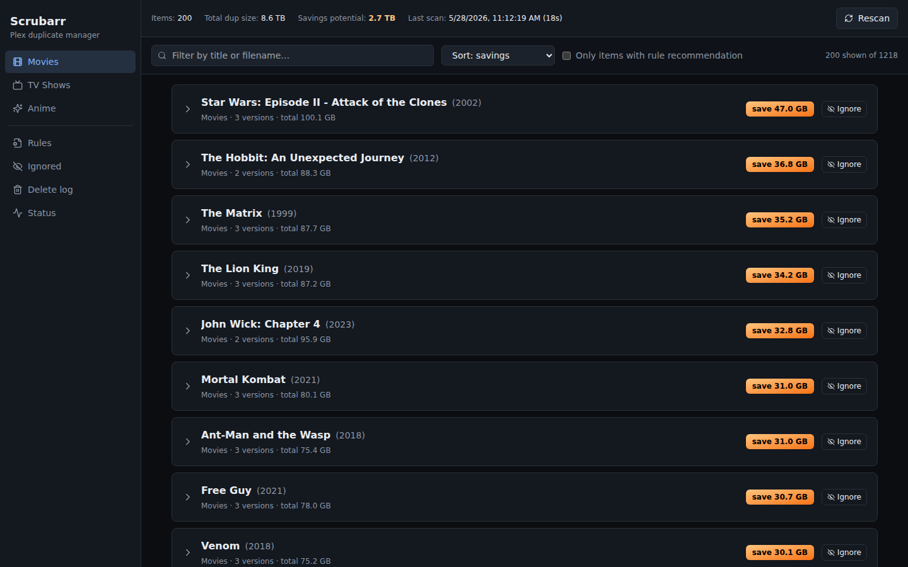
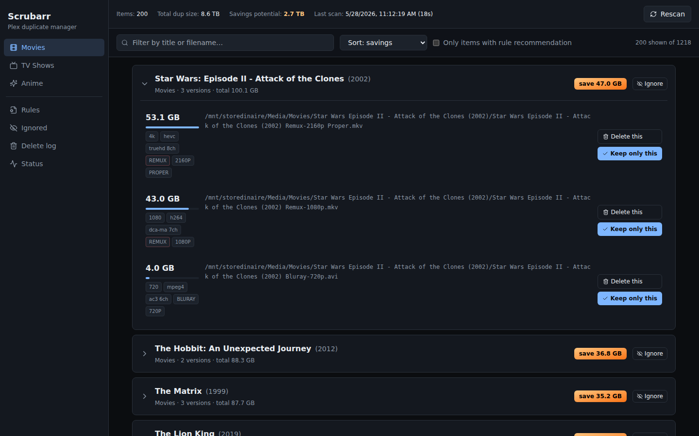
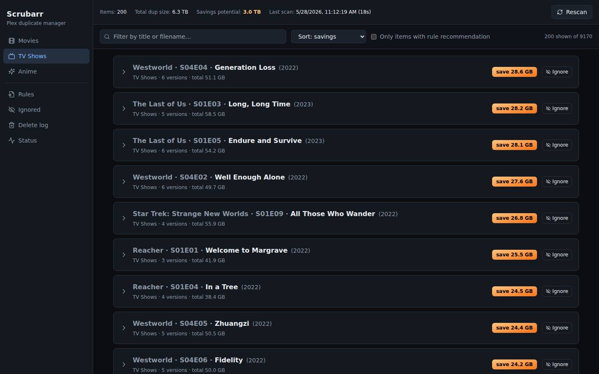
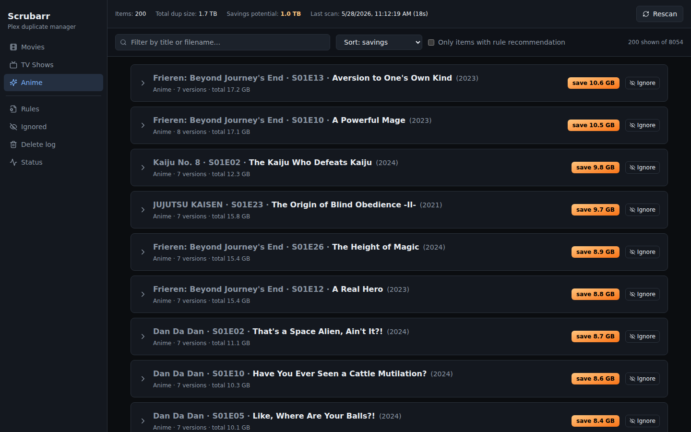
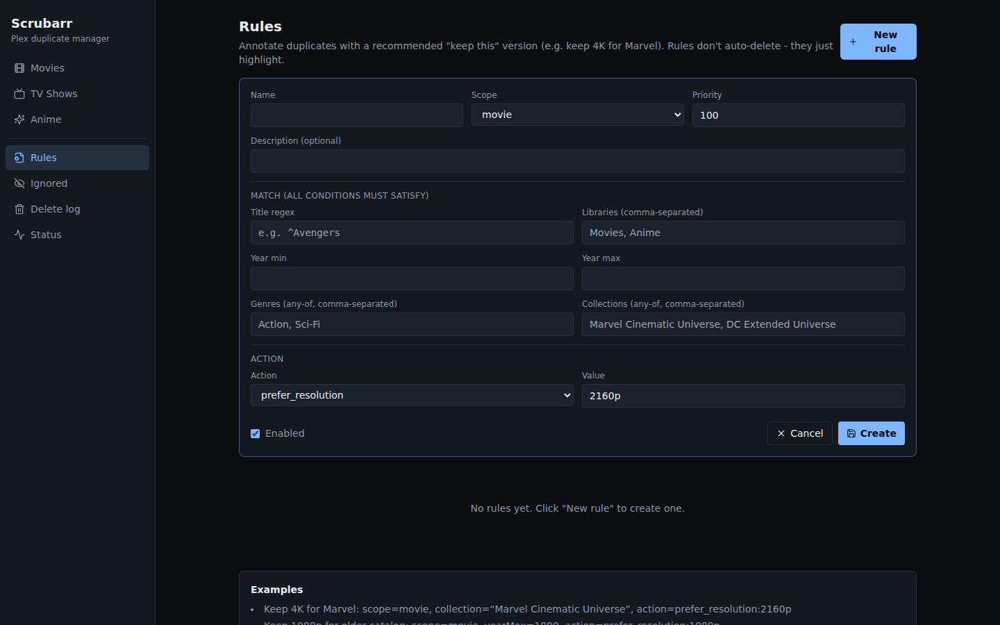
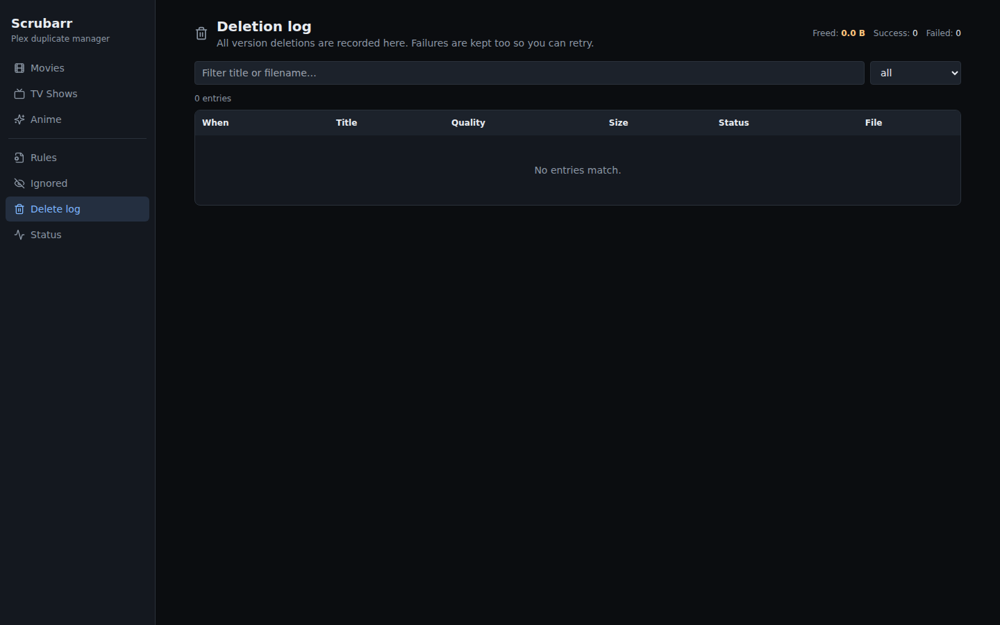
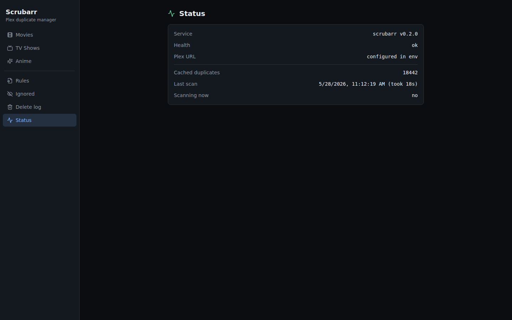

# Scrubarr

A web app for finding and removing duplicate movies, episodes, and anime in a Plex library.

Scrubarr scans Plex for items that have multiple file versions (1080p plus 4K, multiple language variants, REMUX vs WEB-DL, and so on), shows them in a sortable list, and lets you delete the version you don't want with two clicks. Rules can flag a recommended version automatically (for example, keep 4K for Marvel movies).

It is meant to replace selexin/cleanarr, which is unmaintained and tends to time out on large libraries.

## Screenshots

### Movies view


### A movie with three versions expanded
Each version shows its size, resolution, codec, audio, parsed quality tags from the filename, and a "Keep only this" button that deletes every other version with one click.



### TV and Anime episodes
Episodes that have multiple files are listed individually with their show + season/episode prefix.




### Rules
Create rules that highlight a "recommended" version. Rules never auto-delete; they annotate the list so you can act on it.



### Deletion log
Every delete attempt is recorded with the file path, size, codec, resolution, and tags. Total freed bytes is computed across all successful deletions.



### Status
Plex health, scan timing, and item counts at a glance.



## Features

- **Movies, TV shows, and anime** in separate views, each with its own filtering and sorting.
- **Per-version actions**: delete a specific version, or keep one and delete every other version of the same title.
- **Rules engine**: write conditions (title regex, year range, genres, collections, studios) and an action (prefer a resolution, prefer the largest file, prefer a codec, ignore the title, flag for review). Rules annotate the list with a recommended "keep this" version; they never auto-delete.
- **Ignore list**: titles you do not want to consider for deduplication are stored persistently, restorable at any time.
- **Deletion log**: every delete attempt is recorded (file path, size, resolution, codec, tags, success or failure, error reason). Filter and search across the full history.
- **Self-cleaning cache**: items that no longer have at least two versions are dropped from the list automatically on rescan and after each successful delete, so the UI stays in sync without manual refresh.
- **Responsive UI**: works on desktop and mobile, dark theme.
- **Auto-rescan**: pulls fresh data from Plex every 15 seconds while you have the page open. Trigger a full rescan on demand from the header.

## How it works

1. On startup, Scrubarr asks Plex for every library section.
2. For movie libraries, it queries `/library/sections/{key}/all?duplicate=1` to get items with multiple Media versions.
3. For TV libraries (including any library whose name contains "anime"), it walks `/library/metadata/{showKey}/allLeaves` per show with duplicate episodes and surfaces each duplicated episode individually.
4. Each Media version is enriched with parsed quality tags from its filename (REMUX, BluRay, WEB-DL, HDR, HDR10, DV, Atmos, MULTI, FRENCH, PROPER, and more).
5. The result is cached in memory and served to the UI as JSON. The cache is also reconciled on every rescan: items that no longer qualify as duplicates are removed.

Deletions use the Plex API endpoint `DELETE /library/metadata/{ratingKey}/media/{mediaId}`. This removes a specific Media version from the metadata and removes its files from disk (Plex must have "Empty trash automatically after every scan" enabled, or you can call refresh manually).

## Running with Docker

The simplest path is the bundled `docker-compose.yml`. Copy `config/.env.example` to `config/.env`, fill in your Plex token, and run:

```bash
docker compose up -d
```

The container will:

- Apply the Prisma schema to `/db/scrubarr.db` on startup
- Serve the UI on port 8080
- Connect to Plex at `PLEX_BASE_URL` (default `http://172.18.0.1:32400` for docker bridge access on the same host)

### Environment variables

| Variable | Default | Description |
|---|---|---|
| `PLEX_BASE_URL` | `http://172.18.0.1:32400` | URL the container uses to reach Plex |
| `PLEX_TOKEN` | (required) | A Plex X-Plex-Token with admin access |
| `DATABASE_URL` | `file:/db/scrubarr.db` | SQLite database file path |
| `LOG_LEVEL` | `INFO` | `INFO` or `DEBUG` |
| `VIRTUAL_HOST` | `scrubarr.selfcollapse.com` | Used by jwilder/nginx-proxy if you front Scrubarr with it |
| `LETSENCRYPT_HOST` | same as `VIRTUAL_HOST` | Used by acme-companion for cert provisioning |
| `LETSENCRYPT_EMAIL` | (none) | Email for Let's Encrypt account |

### Where to find your Plex token

In Plex Web, click any item, open the three-dot menu, choose "Get Info", click "View XML". The token is the `X-Plex-Token` query parameter in the URL bar.

## Rules

Rules are evaluated in priority order (lower number first). The first matching rule sets the recommended action for a duplicate item.

### Match fields

| Field | Type | Meaning |
|---|---|---|
| `titleRegex` | string | Case-insensitive JavaScript regex tested against the item title |
| `yearMin`, `yearMax` | number | Inclusive year range |
| `libraries` | string[] | Restrict to specific Plex library names (e.g. `["Movies"]`) |
| `genres` | string[] | Any-of match against the item's Plex genres |
| `collections` | string[] | Any-of match against Plex collection memberships |
| `studios` | string[] | Any-of match against studio |

### Action kinds

| Kind | Value | Effect |
|---|---|---|
| `prefer_resolution` | `2160p`, `1080p`, `720p`, `480p` | Recommend the largest version at that resolution |
| `prefer_largest` | (none) | Recommend the largest version overall |
| `prefer_codec` | substring of `videoCodec` like `x265` | Recommend the largest version matching that codec |
| `mark_review` | (none) | Just flag the item with the rule name in the UI |
| `ignore` | (none) | Hide the item from the duplicate list |

### Example: keep 4K for the Marvel Cinematic Universe

```json
{
  "name": "Marvel keeps 4K",
  "scope": "movie",
  "priority": 10,
  "match": { "collections": ["Marvel Cinematic Universe"] },
  "action": { "kind": "prefer_resolution", "value": "2160p" }
}
```

### Example: keep 1080p for older catalog

```json
{
  "name": "Catalog keeps 1080p",
  "scope": "movie",
  "priority": 50,
  "match": { "yearMax": 1990 },
  "action": { "kind": "prefer_resolution", "value": "1080p" }
}
```

### Example: auto-ignore subbed anime before 2010

```json
{
  "name": "Pre-2010 anime ignored",
  "scope": "anime",
  "priority": 5,
  "match": { "yearMax": 2010 },
  "action": { "kind": "ignore" }
}
```

## API

All endpoints return JSON. The API is meant for the bundled UI but is fully usable from scripts.

| Endpoint | Method | Purpose |
|---|---|---|
| `/api/dupes` | GET | Current cached duplicates plus scan state |
| `/api/rescan` | POST | Start a fresh Plex scan in the background |
| `/api/dupes/{ratingKey}/media/{mediaId}` | DELETE | Delete a single Media version |
| `/api/ignore` | GET / POST / DELETE | List, add, or remove ignored items |
| `/api/rules` | GET / POST / DELETE | List, upsert, or delete rules |
| `/api/log` | GET | Paginated deletion log with totals |
| `/api/health` | GET | Liveness probe |

## Development

```bash
npm install
cp config/.env config/.env.local   # add your Plex token
npm run db:push                    # apply schema to local sqlite
npm run dev                        # http://localhost:3000
```

Stack: Next.js 14 App Router, TypeScript, Tailwind, Prisma, SQLite. Single-process Node server, no background workers, no external state.

## License

MIT.
